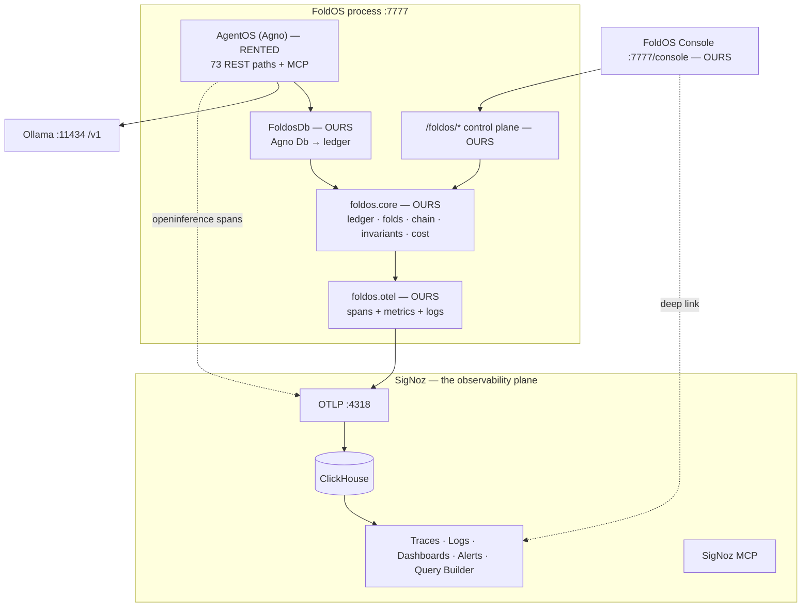

# FoldOS — Product & Build Specification v6

*Supersedes [FoldOS-PRD-v5.md](FoldOS-PRD-v5.md) and [FoldOS-ARCHITECTURE.md](FoldOS-ARCHITECTURE.md). The semantics in [FoldOS-FORMAL-MODEL.md](FoldOS-FORMAL-MODEL.md) and the journeys in [FoldOS-USER-FLOWS.md](FoldOS-USER-FLOWS.md) survive unchanged — they always described our behaviour, not Statefold's.*

*Target reader: Claude Code, with repo access. Verified facts are unmarked; assumptions are ⚠️.*

---

## 1. The product

> **Every agent framework treats state as a variable you overwrite. FoldOS treats it as a ledger you append to.**

That single change makes agent runs rewindable, policy backtestable, and history tamper-evident. And because every entry in the ledger is also an OpenTelemetry span *and* a structured log record, all of it is visible in SigNoz — traces, metrics, logs, dashboards, and alerts over the agent's actual decision history, not a sampled sidecar of it.

**FoldOS is an agent platform.** Agno is its runtime, the way FastAPI is a web app's runtime. SigNoz is its observability plane. The event-sourced state core, the governance layer, and the time/position join are ours.

---

## 2. What changed from v5, and why

v5 built an OpenTelemetry exporter *for Statefold*. That made FoldOS a plugin for a three-week-old library with no adoption, and its own best move — contributing the exporter upstream — dissolved the product.

**v6 owns the substrate.** We implement the capabilities ourselves: append-only event log, folds, hash chain, invariants, cost accounting, time travel, forking. Statefold is no longer a dependency.

**What this costs:** ~1,000 lines of core we now write, and the loss of `statefold/ui.py` as a free console (§9).
**What survives:** every verified fact about Agno (§5.1), the exporter design (now internal, and better for it), the formal model, and the user flows.

---

## 3. Positioning

**One sentence:** *FoldOS is an agent platform whose state is an append-only ledger, so you can rewind any run, backtest a policy against real history, and prove the record wasn't edited — observable end-to-end in SigNoz.*

**Frame: audit/governance, not debugging.** Agent observability is crowded (LangSmith, Langfuse, Braintrust, Phoenix, Weave). "Traces for agents" is not a wedge. "The policy lives inside the audit log it governs, and you can replay it against last month" is.

**Three claims, in strength order:**
1. **Policy backtesting** — change a rule, re-fold real history, see what it *would* have blocked. Deterministic, free, impossible without a ledger.
2. **Governance as data** — budgets are events, so changing a limit is itself auditable and tamper-evident.
3. **Time-addressable state** — any span in SigNoz resolves to the exact agent state at that instant (§6.5).

⚠️ **Do not claim** that re-folding a modified tool result predicts what the agent *would have done next*. It doesn't — the model's subsequent choices aren't a function of the fold. Backtest **policies** (pure functions of recorded events), not behaviour.

---

## 4. Architecture



One Python process, the SigNoz compose stack, and Ollama. No new datastores.

---

## 5. IP posture — what we rent, own, and credit

### 5.1 Rented (dependencies, Apache-2.0, unmodified)

| Component | Gives us | Verified |
|---|---|---|
| `agno.os.AgentOS` | 73 REST paths, MCP server, Slack/WhatsApp/AG-UI interfaces | ✅ booted, OpenAPI enumerated |
| `agno.agent` / `agno.team` | Tool-calling loop, teams, checkpoints | ✅ ran against Ollama |
| `openinference-instrumentation-agno` | `Agent.run`, `Team.run`, `*.invoke`, tool spans | ✅ in ClickHouse |
| `agno.models.openai.like.OpenAILike` | Ollama over an instrumentable `openai.OpenAI` | ✅ |
| SigNoz (Foundry) | OTLP, ClickHouse, dashboards, alerts, MCP | ✅ running, MIT outside `ee/` |

### 5.2 Owned (we write)

`foldos.core` · `foldos.otel` · `foldos.policy` · `foldos.control` · `foldos.db` · `foldos.console` · `foldos.provision`. **~1,900 lines.**

### 5.3 Credit

Our event model is informed by reading [Statefold](https://github.com/ioteverythin/statefold) (Apache-2.0). Say so in the README, once, plainly: *"FoldOS's event model was informed by Statefold's design; no Statefold code is used."* It's true, it costs a sentence, and it reads far better than implied independent invention. Do not vendor their code, including `ui.py`.

---

## 6. Core specification — `foldos/core/`

This is the part Claude Code builds from scratch. Precision here is the whole schedule.

### 6.1 `types.py` (~60 lines)

```python
@dataclass(frozen=True)
class Scope:
    tenant: str; agent: str; session: str; thread: str = "main"
    def key(self) -> str: ...            # "tenant/agent/session/thread"

@dataclass
class Event:
    kind: str                    # message|tool_call|llm_call|span_start|span_end|state_delta|policy_set
    payload: dict
    actor: str = "agent"
    causation_id: str | None = None      # parent span id
    id: str = <sortable uuid>
    ts: str = <iso8601 utc>
    seq: int = 0                 # assigned on append, gap-free per stream
    hash: str = ""               # assigned on append
```

`seq` is a **logical clock**; `ts` is the physical clock. §6.5 is the map between them — the product's core idea.

### 6.2 `chain.py` (~50 lines)

`hash = sha256(prev_hash || canonical(event))`, canonical form = JSON with sorted keys over `{seq, kind, payload, actor, ts}` — **excluding `id`**, so forks that re-id history still verify. `verify(store, scope) -> {ok, broken_at, events}`.

⚠️ **State the threat model honestly:** unkeyed SHA-256 detects edits that don't recompute the chain (a bug, a stray `UPDATE`, a partial tamper). It does **not** stop a privileged operator who can rewrite everything. If time permits, add HMAC with a key held outside the store, or periodically emit the head hash to SigNoz as a metric — an external anchor the store can't retroactively change. **That anchor is a genuinely novel use of an observability backend and worth the 20 minutes.**

### 6.3 `store.py` (~200 lines)

`Store` Protocol + `InMemoryStore`. `append` is the only interesting method, and its ordering is load-bearing:

1. Check `head == expected_seq`, else `ConcurrencyError` (optimistic concurrency; caller retries).
2. Assign `seq` to each event.
3. **Run invariants against the folded state** — batch-validated, advancing state event by event.
4. Compute hashes.
5. Persist. **Nothing is written unless the whole batch passes.**

Steps 3-5 must be atomic under a lock. A rejected append leaves `head` unchanged — that property is the demo.

Also: `get_state(scope, as_of=None)`, `read_events(scope, after=0)`, `fork(scope, at_seq, new_thread)`, `head(scope)`.

### 6.4 `reducers.py` + `usage.py` (~200 lines)

`@reducer(kind)` registry; `fold(events) -> state`. State shape:

```python
{"messages": [...], "tools": [...], "spans": {...},
 "data": {...},                       # working memory, incl. policy values
 "usage": {"llm_calls", "input_tokens", "output_tokens",
           "cost_usd", "uncosted_calls", "by_model", "tools"}}
```

**Cost resolves at fold time**, not write time — so registering a price later back-fills history without rewriting the log. Count `uncosted_calls` separately; never silently report `$0`.

### 6.5 `clock.py` (~80 lines) — the join, and the differentiator

```python
def pos(store, scope, t) -> int:       # max{n : ts(n) <= t}, else 0. Total, monotone.
def cut(store, scopes, t) -> dict[str, int]:   # consistent cut across streams
```

Every span — including Agno's, which carry no `seq` — resolves to a position via `pos`. `state_at(span) = get_state(scope, as_of=pos(span.start))`. Without this, the "click any span, see the state" promise fails on the majority of spans in a real trace (measured: 5 of 9).

**Stream topology: one stream per `(agent, session)`.** A team of three yields three streams plus the coordinator's, giving per-member cost attribution. Cross-member questions use `cut`, not `as_of`.

### 6.6 `policy.py` (~100 lines)

```python
@invariant("llm_call")
def budget_cap(state, event):
    budget = state["data"].get("budget_usd")
    if budget is not None and state["usage"]["cost_usd"] > budget:
        raise PolicyViolation(...)
```

**The budget is set by an event** (`policy_set` → `state["data"]["budget_usd"]`), not by config. Learned the hard way: validation sees folded state and the event, never the scope — so per-tenant limits can only live *in* the stream. This turns out to be the better design: per-stream by construction, time-travelable, and every limit change is itself in the hash chain.

**Backtesting** (`backtest(store, scope, policy) -> [violations]`) re-folds recorded history against a *different* policy and reports what it would have blocked. This is claim #1 of the product and it's ~30 lines.

### 6.7 `session.py` (~200 lines)

Façade: `add_message`, `add_tool_call`, `add_llm_call`, `set`/`unset`/`get`, `usage`, `state`, `span()` (async context manager, contextvar-parented), `trace()`, `head`, `fork`. Retries `ConcurrencyError` internally (8 attempts).

### 6.8 `db.py` (~150 lines) — Agno bridge

Subclass `agno.db.in_memory.InMemoryDb`; override `upsert_session`, `delete_session`, `upsert_user_memory`, `delete_user_memory` — call `super()` first, then append to the ledger. Rehydrate Agno's caches from the ledger on construction (this is what makes restart-resume work).

⚠️ **This does not capture tool or LLM calls.** Those come from `instrument_openai(model.get_client(), session)` and a `@traced_tool` decorator. There is no third path — do not expect the Db adapter to produce them.

---

## 7. Observability design — the SigNoz plane

SigNoz is a hard requirement and a judging criterion. Use every surface, and use each one for something it's actually good at.

| SigNoz surface | What we send | Why it's the right surface |
|---|---|---|
| **Traces** | Every `span_start`/`span_end` as a real span; `tool_call`/`llm_call` synthesized from `latency_ms`, nested under Agno's spans | Causal structure of a run |
| **Logs** | **Every event as a structured log record**, `trace_id`/`span_id` attached, full payload in attributes | **SigNoz's Logs tab becomes the event-log browser — log↔trace correlation for free, and ~300 lines of console we don't build** |
| **Metrics** | `foldos.llm.{calls,input_tokens,output_tokens,cost_usd,latency_ms}`, `foldos.tool.calls`, `foldos.policy.violations`, `foldos.chain.head_hash_anchor` | Dashboards + alert rules |
| **Alerts** | Rule on `foldos.policy.violations > 0` | Budget breach paging |
| **Dashboards** | Provisioned as code from `foldos/provision/dashboards/*.json` | Reproducible for judges |
| **Query Builder** | Live ad-hoc group-by during the demo | Criterion 4 explicitly rewards it |
| **MCP** | Cross-system investigation (Flow 6) | Best 30 seconds of the demo |
| **LLM Observability** | Full `gen_ai.*` semconv on every `llm_call` span | SigNoz ships a **purpose-built GenAI page** (`frontend/src/pages/LLMObservability/`) keyed on `gen_ai.request.model` (alias `llm.model`), with model-pricing rules and an unpriced-models tab. We already emit that attribute — **verify it populates, it is nearly free** |
| **Host metrics** | `hostmetrics` receiver in `casting.yaml` | One more signal class for ~15 minutes |
| **Errors/Exceptions** | Error-status spans from policy violations and tool failures | Populates SigNoz's error views at no extra cost |
| **Service accounts** | Provision via a real service account key, not a session token | The documented path for API access |

**Build with SigNoz's own agent skills.** SigNoz ships an official Claude Code plugin — [SigNoz/agent-skills](https://github.com/SigNoz/agent-skills) — covering queries, dashboards, alerts, docs, and MCP setup. Install it before Phase 7. It closes the one ⚠️ left in this spec (unknown dashboard/alert JSON schemas) and *"we built our dashboards using SigNoz's own agent skills"* is a strong line under criterion 4.

⚠️ **Positioning consequence — read this.** SigNoz's LLM Observability already does token and cost tracking, with its own pricing rules. **"We track agent cost" is therefore not a differentiator — the sponsor ships it.** Lean on it, don't compete with it: let SigNoz own cost visualisation, and keep FoldOS's claim on what only a ledger can do — replay, policy backtesting, time-addressable state, and tamper evidence. Adjust demo emphasis accordingly.

**Emission rules, learned by running it:**

1. Own the `TracerProvider`, then call `AgnoInstrumentor().instrument(tracer_provider=provider)` **explicitly**. Never call Agno's `setup_tracing()` — it early-returns when a provider exists (`agno/tracing/setup.py:71-75`) *before* instrumenting, silently yielding zero Agno spans.
2. Capture ambient OTel context on the caller's thread **before any `await`**.
3. **Hold spans open**: start a real non-current span at `span_start`, `.end(end_time=…)` at `span_end`. Children finish before parents; retroactive emission breaks parenting.
4. Never mutate an event — `verify` must stay green. Standing regression test.
5. Wrap all emission in `try/except: pass`. Telemetry must never break a write.
6. Guard the open-span map with a lock and sweep orphans on shutdown (end them `ERROR`), or they leak and never export.
7. `BatchSpanProcessor` in the app; `SimpleSpanProcessor` only when debugging.

Emitting from **inside** the core (rather than wrapping a foreign store, as v5 did) removes an entire class of bug — there is one write path and it already holds the lock.

---

## 8. API surface — `foldos/control/`

Mounted on the AgentOS FastAPI app (verified mountable).

| Method | Path | Purpose |
|---|---|---|
| GET | `/foldos/cut?at=<ts>&session=` | **Time → position.** Unblocks Flow 2 |
| GET | `/foldos/state/{session}?as_of=N` | Folded state at N |
| GET | `/foldos/events/{session}?after=N` | Raw ledger |
| GET | `/foldos/usage/{session}?as_of=N` | Spend as of N |
| GET | `/foldos/verify/{session}` | `{ok, broken_at, events}` |
| GET | `/foldos/attestation/{session}` | Session, count, head hash, verified-at |
| POST | `/foldos/policy` | Set a limit (emits `policy_set`) |
| POST | `/foldos/backtest` | Re-fold history against a candidate policy |
| POST | `/foldos/branch` | `fork(at_seq, thread)` |
| POST | `/foldos/replay` | Re-execute from a branch; tag `foldos.replay_of` |
| GET | `/foldos/trace-index` | `(seq ↔ trace_id/span_id)`, both directions |

Where AgentOS already has an endpoint (`/agents/{id}/sessions/{sid}/fork`, `/traces*`), prefer Agno's and add only what is ledger-specific.

---

## 9. Console — `foldos/console/` (~300 lines, single file, no build step)

The pivot costs us Statefold's UI, so build the minimum and **push everything else to SigNoz**:

1. **Stream list + event table**, `as_of` scrub slider (the time-travel control).
2. **"Open in SigNoz"** per event → `http://localhost:8080/trace/{trace_id}?spanId={span_id}` — verified to deep-link *and* auto-expand ([TraceDetailsV3/index.tsx:58](signoz/frontend/src/pages/TraceDetailsV3/index.tsx#L58)).
3. **Integrity badge** — green chain / red `broken_at`.
4. **Policy panel** — budget vs. live spend, violations, and the **backtest** control.

Serve from FastAPI with an inline HTML/JS template. No React, no bundler. Waterfalls, search, and dashboards are SigNoz's job — that's the point of §7.

---

## 10. Build phases and gates

| Phase | Work | Gate | Est. |
|---|---|---|---|
| 0 | Repo, `casting.yaml` + `.lock` at root with `mcp.enabled: true`, re-pour, deps (`agno[os]`, `openai`, `fastmcp`, otel) | `/api/v1/version` 200; MCP container up; clean `pip install -e .` | 30 m |
| 1 | `core/`: types, chain, store, reducers, usage, session | `pytest`: append/fold/`as_of`/fork/chain-verify/concurrency-retry all green | **2.5 h** |
| 2 | `otel/`: spans + metrics + logs, per §7 rules | One run → single trace with Agno + `foldos.*` spans; logs correlated by trace_id | 1.5 h |
| 3 | `db.py` + composition root + `AgentOS` + `/foldos/*` | `/openapi.json` ≥73 paths + `/foldos/*`; agent run lands in ledger *and* SigNoz | 1.5 h |
| 4 | `policy.py`: budget-as-event, veto, violation metric, **backtest**; SigNoz alert rule | Veto leaves `head` unchanged; alert fires; backtest returns counterfactual violations | 1.5 h |
| 5 | `clock.py`: `pos`/`cut`, `/foldos/cut`, trace index both ways | Any span (incl. `Agent.run`) resolves to state | 1 h |
| 6 | Console (§9) | Click an event → correct SigNoz span opens | 1.5 h |
| 7 | Provisioning, dashboards, Query Builder rehearsal, MCP flow | Fresh SigNoz → populated dashboards via `python -m foldos.provision` | 1 h |
| 8 | Screenshots, <3 min video, blog, submission + **AI disclosure** | Submitted | 2 h |

**~13 hours.** Phases 1-4 are the minimum submittable product; 5 and 6 are the differentiators.

**Parallelism:** phase 1 is the critical path and everything depends on it. Get `core/` right before anything else; a bug there surfaces as a mystery in phase 4.

---

## 11. Risks

| Risk | Severity | Mitigation |
|---|---|---|
| Writing 1,900 lines in a day | **High** | Phases 1-4 only are submittable; 5-6 droppable. Test `core/` hard — it's load-bearing |
| Reimplementation bug in fold/chain | High | Property test: `fold(events[:n]) == get_state(as_of=n)` for all n |
| Hash chain over-claimed | Med | State the threat model (§6.2); add the SigNoz head-hash anchor |
| Backtest confused with behavioural prediction | Med | Script the wording; never claim the model's next move |
| Ollama 1-2 s/call vs. 3-min video | Med | Pre-warm, terse prompts, trim in edit |
| Agno API drift | Low | Pin `agno==2.8.2` (verified) |
| **Non-disclosure DQ** | **Critical** | "Built with Claude Code" in README **and** submission form |

---

## 12. Decisions

| # | Decision | Rationale |
|---|---|---|
| 1 | Own the state core; drop Statefold | Removes dependency on an unadopted library; makes FoldOS a product, not a plugin |
| 2 | Rent Agno as runtime | 73 endpoints + MCP for one constructor call; differentiation was never the tool loop |
| 3 | SigNoz is the observability plane, not a pluggable backend | Sponsor requirement and judging criterion; also lets Logs replace most of the console |
| 4 | Every event → span **and** log record | Deep SigNoz usage, free log↔trace correlation, ~300 fewer lines of UI |
| 5 | Emit from inside the core | One write path, already locked — kills the leak and race the v5 wrapper had |
| 6 | Budget as an event, not config | Forced by the validation signature; better anyway — auditable, time-travelable |
| 7 | Lead with policy backtesting | The only claim that is deterministic, free, and impossible without a ledger |
| 8 | Audit framing over debugging | Crowded field; hash chain becomes load-bearing instead of decorative |
| 9 | Head-hash anchor as a SigNoz metric | Turns the observability backend into an external tamper anchor — genuinely novel |
