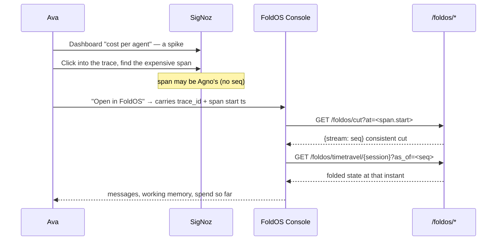

# FoldOS — User Flows

*Grounded in the verified surface: AgentOS's 73 REST paths, the `/foldos/*` control plane, the forked Statefold console, SigNoz's UI and API, and three MCP servers. Operations reference [FoldOS-FORMAL-MODEL.md](FoldOS-FORMAL-MODEL.md).*

---

## 1. Personas

| Persona | Cares about | Primary surface |
|---|---|---|
| **Ava** — agent developer | Why was this run wrong, slow, or expensive? | FoldOS Console + SigNoz Traces |
| **Ravi** — platform owner | Are agents inside budget? What broke, when? | SigNoz dashboards + alerts |
| **Dana** — auditor / approver | Can I prove this autonomous agent behaved? | Console integrity + policy panels |
| **The judge** — 3 minutes, no context | Is this real, and is it new? | The video |

Ava and Ravi are the *debugging* frame; Dana is the *audit* frame. §8 marks which flows serve which, so the framing decision from the formal model applies cleanly.

---

## 2. Surface map

| Surface | Port | Origin | Role |
|---|---|---|---|
| FoldOS Console | `:7777/console` | forked `statefold/ui.py` | Event log, time-travel scrub, branch, integrity, policy |
| FoldOS control API | `:7777/foldos/*` | **we write** | Cuts, branch, counterfactual, verify, index |
| AgentOS API + MCP | `:7777/*` | Agno, lifted | Run agents, sessions, memory, approvals |
| SigNoz | `:8080` | lifted | Traces, Query Builder, dashboards, alerts |
| SigNoz MCP | container | lifted | Telemetry as agent tools |
| Statefold MCP | stdio | lifted | `state_get(as_of)`, `state_verify` |

**The pivot between Console and SigNoz is `/trace/{trace_id}?spanId={span_id}`** — verified to deep-link and auto-expand to the span ([TraceDetailsV3/index.tsx:58](signoz/frontend/src/pages/TraceDetailsV3/index.tsx#L58)).

---

## 3. Flow 0 — The judge (the actual deliverable)

Under 3 minutes. Four beats. Every number on screen is real.

| # | Beat | Screen | Say | Sec |
|---|---|---|---|---|
| 1 | Framing | Statefold's roadmap, "OpenTelemetry exporter" unchecked | *"This box was empty this morning. We built it."* | 0-20 |
| 2 | Architecture | The §2 mermaid diagram | *"Agno runs the agents. Statefold records every change as an event. SigNoz sees none of it — until now."* | 20-50 |
| 3a | **Correlated trace** | SigNoz Traces, one tree | *"Agno's spans and Statefold's events, one trace. Real tokens, real cost."* | 50-80 |
| 3b | **Budget as an event** | Console policy panel → violation → SigNoz alert | *"The budget isn't config. It's an event inside the log it governs — so raising it is tamper-evident."* | 80-125 |
| 3c | **Counterfactual** | Console: rewrite a recorded tool result → re-fold → cost curve diverges | *"We rewound, changed what the tool returned, and recomputed the whole session. No model was called. That's only possible because state is a fold."* | 125-155 |
| 3d | **Integrity** | Edit an event → `verify` → `broken_at: 3` | *"And you can prove none of it was edited."* | 155-170 |
| 4 | Close | README attribution | *"Apache-2.0, credited, PR opened upstream. Built with Claude Code."* | 170-180 |

**Why counterfactual over re-execution:** re-execution is "resume from a checkpoint," which Agno already does. Counterfactual is free, deterministic, and impossible without an event log. Same build effort, much stronger claim.

**Cut order under time pressure:** 3d, then 3c. Beats 3a and 3b are the submission.

---

## 4. Flow 1 — Setup (Ava, first 10 minutes)

```
git clone … && cp .env.example .env
docker compose … (Foundry pour, mcp.enabled: true)
pip install -e .
python -m foldos.provision        # dashboards + alert rules
python -m foldos.app              # :7777
```

1. Ava opens `:7777/docs` → sees 73 AgentOS paths + `/foldos/*`. **Instant credibility that this is a platform, not a script.**
2. Opens `:7777/console` → empty event log, integrity badge green (`ok: true, events: 0`).
3. Runs `POST /agents/analyst/runs` with a prompt.
4. Console streams events via `/api/tail`; SigNoz shows the trace within ~2s.

**Gate:** if the console is empty but SigNoz has spans, the exporter isn't wrapping the store. If the reverse, check §4.1 of the architecture doc — `AgnoInstrumentor` wasn't attached.

---

## 5. Flow 2 — "Why did this run cost so much?" (Ava) — the core loop

This is the flow the whole product exists for. It is the only one that requires all three systems.



**Step 4 is the part that had a bug.** The formal model's `pos_S` makes it work for *any* span — including `Agent.run` and `OpenAILike.invoke`, which carry no `statefold.seq`. Without it, this flow fails on 5 of the 9 spans in our own demo trace.

Ava's exit: *"the agent re-read the same 4KB document on every one of six tool calls — it was in working memory the whole time."* That conclusion is unavailable from traces alone, because traces record calls, not knowledge.

---

## 6. Flow 3 — Counterfactual (Ava)

**Question:** "If the search tool had returned the right answer at step 12, would the run still have cost $2?"

1. Console → scrub the waterfall to `seq=12`, select the `tool_call` event.
2. **"Fork & rewrite"** → editable payload; change `result`.
3. `POST /foldos/counterfactual` → `fork(at_seq=11, new_thread="cf-1")`, append the modified event, re-fold. **No model is called.**
4. Console shows both timelines side by side; the cost curve diverges at 12.
5. Optional: `POST /foldos/replay` to *actually* re-execute from the fork (tokens spent, tagged `foldos.replay_of`) and compare all three.

**Contract to state plainly:** steps 1-4 are deterministic and free. Step 5 is not. The formal model's three-way taxonomy exists so this distinction is never blurred in the UI or the video.

---

## 7. Flow 4 — Budget governance lifecycle (Ravi)

| Phase | Action | Surface | Result |
|---|---|---|---|
| Set | `POST /foldos/policy` → `session.set(budget_usd=0.50)` | Console policy panel | A `state_delta` **event** — hash-chained, time-travelable |
| Observe | Cost gauge vs. budget | Console + SigNoz | Live spend from the fold |
| Enforce | Agent exceeds it | `@invariant("llm_call")` | `InvariantViolation` — **write rejected, stream head unchanged** |
| Signal | `note_violation()` | error span + `statefold.invariant.violations` | Alert fires in SigNoz |
| Investigate | Alert → trace → cut → state | Flow 2 | Which agent, which step, what it knew |
| Adjust | Raise the budget | Console | Another event — *the change itself is auditable* |

The last row is the point. In a config-based system, raising a budget is invisible. Here it is an entry in a tamper-evident chain, sitting in the same log as the spending it authorizes.

---

## 8. Flow 5 — Attestation (Dana) — the audit frame

**Question:** "This agent spent $4,000 last month autonomously. Prove the record wasn't altered."

1. Console → **Integrity** badge → `GET /foldos/verify/{session}` → `{ok: true, events: 1284}`.
2. Export the attestation: session, event count, head hash, verified-at timestamp.
3. Spot-check: scrub to any step, see the exact state and spend at that moment (`as_of`).
4. Policy history: every `budget_usd` change, in order, with its position in the chain.
5. Negative control — **demo this**: edit one event directly in the store, re-verify → `{ok: false, broken_at: 3}`.

Step 5 is what makes steps 1-4 believable. A green check nobody has seen go red proves nothing.

⚠️ Honest limitation to state on camera: the chain proves *internal* consistency — that history wasn't edited after the fact. It does not prove the events were true when written. That's a hash chain, not a notary.

---

## 9. Flow 6 — Cross-system investigation via MCP (the "wow" moment)

Ava asks one agent, wired to all three MCP servers:

> *"Why did the budget alert fire on session s1?"*

| Step | MCP server | Tool | Returns |
|---|---|---|---|
| 1 | SigNoz | query metrics | `statefold.invariant.violations` spiked at 14:32 |
| 2 | SigNoz | find trace | `trace_id` at that timestamp |
| 3 | FoldOS | `/foldos/cut?at=14:32` | `seq=87` |
| 4 | Statefold | `state_get(as_of=87)` | spend `$0.51`, budget `$0.50` |
| 5 | Statefold | `state_verify` | chain intact |

Answer: *"The research agent's summarize tool looped six times on a 4KB document, crossing the $0.50 budget at step 87. The invariant rejected the seventh call — it was never written. The chain verifies."*

This single exchange covers judging criteria 2 (Creativity) and 4 (Best Use of SigNoz), and it is the strongest 30 seconds available. It is also the flow most likely to break live — **record it as a fallback take**.

---

## 10. Flow matrix

| Flow | Frame | Build status | Demo priority |
|---|---|---|---|
| 0 · Judge | both | script only | **P0** |
| 1 · Setup | both | ✅ verified end-to-end | P0 |
| 2 · Cost investigation | debug | needs `pos_S` + `/foldos/cut` | **P0** |
| 3 · Counterfactual | debug | needs counterfactual endpoint | P1 |
| 4 · Budget lifecycle | audit | ✅ veto verified; needs budget-as-event | **P0** |
| 5 · Attestation | audit | ✅ `verify_chain` verified; needs export | P1 |
| 6 · MCP investigation | both | needs SigNoz MCP enabled | P1 |

**Critical path: 1 → 2 → 4.** Those three plus the video are a complete, honest submission. Flows 3, 5, and 6 are the differentiators, in that order of value-per-hour.

---

## 11. What these flows demand that isn't built yet

1. `GET /foldos/cut?at=<ts>` — the total time→position map. **Flow 2 is broken without it**, which makes this the highest-priority remaining work in the whole project.
2. `POST /foldos/counterfactual` — fork + substitute + re-fold.
3. Budget as `state_delta` rather than a module constant.
4. Console: "Open in SigNoz" per event, "Fork & rewrite" on the waterfall, integrity badge, policy panel.
5. `GET /foldos/attestation/{session}` — signed-ish summary for Flow 5.
6. Inverse index `(trace_id, span_id) → (stream, seq)`, with `pos_S` fallback.

Items 1 and 3 are ~90 minutes combined and unblock two P0 flows. Do them before anything cosmetic.
